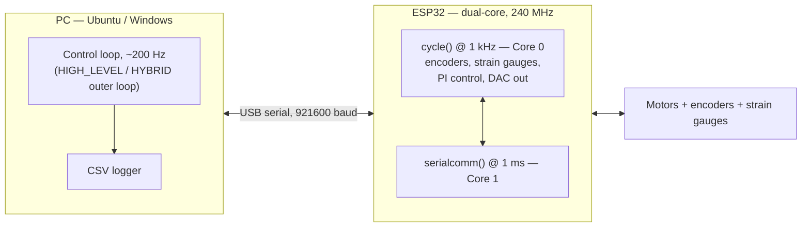

# FlexBot — PC Software (`serialcomm_c`)

Real-time cascade control of a flexible two-joint robot arm — C++17 host +
ESP32 firmware talking over a custom 921600-baud serial protocol at 1 kHz.

<!--
  TODO (needs hardware access): add a photo of the arm and/or a short GIF
  of a HIGH_LEVEL/HYBRID run here. See docs/hardware.md and the "Next
  steps" item on media capture. Keep under ~10 MB, store in docs/media/.
-->

[](https://en.cppreference.com/w/cpp/17)
[](https://cmake.org/)
[](#requirements)
[](https://github.com/FaustoArroyoM/flexbot_firmware)
[](LICENSE)
[](https://github.com/FaustoArroyoM/flexbot/actions/workflows/build.yml)

## Architecture



Three `CTRL_MODE`s change **who closes the loop** — PC (`HIGH_LEVEL`),
ESP32 (`LOW_LEVEL`), or both in cascade (`HYBRID`) — selected at compile
time in both repos' `config.h`. See [Control Modes](#control-modes) below.

## Highlights

- **Compile-time mode dispatch** — `if constexpr` over runtime flags: the
  other two control modes' code is deleted at compile time, and the
  protocol can't silently desync from what the firmware actually runs.
- **Cascade (HYBRID) control** — a 1 kHz PI loop on the ESP32 tracks a
  position reference from a ~200 Hz PC outer loop, decoupling motor
  control bandwidth from USB round-trip latency.
- **Zero-cost timing instrumentation** — `ENABLE_TIMING` compiles away
  entirely when off; per-packet µs timing is buffered on-device and
  merged into the CSV only when explicitly enabled.
- **Crash-safe experiment logging** — a SIGINT-driven atomic flag and
  partial-run CSV save mean a Ctrl-C or a hardware safety trip never
  loses collected data.
- **Reverted fixes, documented not hidden** — a "fix" that was tried,
  hardware-tested, and reverted twice is recorded with the reasoning in
  [`docs/design-decisions.md`](docs/design-decisions.md), alongside five
  other decision write-ups.

## Quick start

Happy path: Ubuntu 22.04 + ESP32 DevKitC. Windows steps are in
[Requirements](#requirements) below.

```bash
# 1. Clone both repos
git clone git@github.com:FaustoArroyoM/flexbot.git
git clone git@github.com:FaustoArroyoM/flexbot_firmware.git

# 2. PC-side build dependencies
sudo apt update && sudo apt install build-essential cmake clangd

# 3. Build the PC host
cd flexbot
cmake -S serialcomm_c -B build && cmake --build build

# 4. USB serial permissions (once per user, then log out/in)
sudo usermod -aG dialout $USER

# 5. Flash the ESP32 — see flexbot_firmware's README for PlatformIO setup
#    (cd ../flexbot_firmware && pio run -t upload)

# 6. Run an experiment
./build/flexbot_app
```

No arm attached? You can still build and run both sides against a bare
ESP32 — see [`docs/hardware.md`](docs/hardware.md) for what that looks
like and the full bill of materials.

---

## Two-Repo System

FlexBot is split across two repositories that must stay in sync:

| Repo | What it is |
|---|---|
| **[`flexbot/`](https://github.com/FaustoArroyoM/flexbot)** (this repo) | PC software: runs the control loop, logs sensor data to CSV |
| **[`flexbot_firmware/`](https://github.com/FaustoArroyoM/flexbot_firmware)** | ESP32 firmware: reads sensors, drives motors, runs inner-loop control |

The two repos share a compile-time constant `CTRL_MODE` and several protocol constants. **Both must be set to the same values and recompiled/reflashed after any change.** The firmware README covers ESP32 IDE setup (VS Code + PlatformIO).

---

## System Overview

FlexBot is a two-joint robot arm. The ESP32 reads joint encoders and strain gauges at 1 kHz and communicates with the PC over USB serial at 921600 baud. The PC runs the experiment, sends control commands, and logs all sensor data to CSV.

Three control architectures are available, selected at compile time:

| Mode | Who computes the output | PC role | ESP32 role |
|---|---|---|---|
| `HIGH_LEVEL` | PC computes full state-feedback K·x → sends a DAC byte each cycle | Closed-loop controller at ~200 Hz | Apply received DAC byte directly |
| `LOW_LEVEL` | ESP32 runs a PI controller autonomously at 1 kHz | Passive data logger — send start/stop only | Full PI control, independent of USB |
| `HYBRID` | ESP32 PI tracks a position reference sent by the PC | Outer-loop reference generator at ~200 Hz | Inner PI at 1 kHz tracking the PC reference |

All mode branching uses `if constexpr` — the compiler removes unused code paths entirely.

---

## Repository Layout

```
flexbot/
├── serialcomm_c/
│   ├── include/
│   │   ├── config.h       ← All tuning parameters and the CTRL_MODE switch
│   │   └── serialib.h     ← Third-party serial library (do not modify)
│   ├── src/
│   │   ├── serialcomm.cpp ← Main program: control loop, CSV logging, serial I/O
│   │   └── serialib.cpp   ← Third-party serial library (do not modify)
│   └── CMakeLists.txt
├── build/                 ← CMake output (generated, not committed)
├── data/
│   └── analyze_timing_data.py ← Loads/plots ENABLE_TIMING CSV columns
├── docs/
│   ├── architecture.md    ← Control modes, packet format, FreeRTOS layout
│   ├── change-log.md      ← Every fix vs. original code, with rationale
│   ├── design-decisions.md ← Decision → alternative rejected → why
│   ├── hardware.md        ← Bill of materials, wiring, vendor datasheet links
│   ├── open-issues.md     ← Active bugs and untested items
│   └── specs/              ← Planning docs for repo-level work (this file's own kind)
├── .github/                ← CI workflow, issue/PR templates
├── LICENSE
├── THIRD_PARTY_NOTICES.md ← serialib attribution and license caveat
└── CLAUDE.md               ← AI-assistant project memory / doc-maintenance rules
```

---

## Requirements

### Ubuntu 22.04

```bash
sudo apt update
sudo apt install build-essential cmake clangd
```

### Windows

- [CMake](https://cmake.org/download/) (add to PATH during install)
- [Visual Studio Build Tools](https://visualstudio.microsoft.com/visual-cpp-build-tools/) with "Desktop development with C++"
- [LLVM/clangd](https://github.com/clangd/clangd/releases) (optional, for IntelliSense)

---

## Build

```bash
# From the repo root
cmake -S serialcomm_c -B build
cmake --build build

# The binary is at:
./build/flexbot_app
```

---

## Serial Port Setup

The port is configured in `serialcomm_c/include/config.h`:

```cpp
#ifdef _WIN32
    constexpr const char* SERIAL_PORT = "COM3";         // ← change to your port
#else
    constexpr const char* SERIAL_PORT = "/dev/ttyUSB0"; // ← change if needed
#endif
```

**Linux — check your port:**
```bash
ls /dev/ttyUSB*
# or watch for it when you plug in:
dmesg | tail -n 10
```

**Linux — USB permissions (required once per user):**
```bash
sudo usermod -aG dialout $USER
# Log out and back in for this to take effect.
```

---

## Running an Experiment

1. Flash the ESP32 firmware (see the firmware README).
2. Build the PC software (see Build above).
3. Run the binary:
   ```bash
   ./build/flexbot_app
   # or save to an explicit path:
   ./build/flexbot_app /path/to/output.csv
   ```
4. Enter the number of samples when prompted. The run starts immediately.
5. Press `Ctrl-C` at any time for a graceful abort — all collected samples are saved.
6. The CSV is written to `data/output_<timestamp>.csv` by default.

**Before starting a run:** hold the arm at the pose you want to treat as the neutral (zero) position. The ESP32 continuously zeros its encoders while stopped, so `pos1 = pos2 = 0` is anchored to the held pose when START fires.

---

## Control Modes

The mode is set in **both** `config.h` files and must be identical. After any change, recompile the PC software **and** reflash the ESP32.

```cpp
// serialcomm_c/include/config.h  AND  flexbot_firmware/include/config.h
constexpr CtrlMode CTRL_MODE = CtrlMode::HIGH_LEVEL;  // ← change this line in both files
```

---

### HIGH_LEVEL — PC full state-feedback controller

The PC computes `u = K · x` every cycle using the received sensor state, converts the result to a DAC byte, and sends it to the ESP32. The ESP32 applies that byte directly to the motor DAC — it runs no local control computation.

**Data flow:**
```
ESP32 → (16-byte sensor packet) → PC
PC: u = K·x → convert to DAC byte → send FLAG_CONTROL + out1d + out2d
ESP32 → applies DAC byte → (next sensor packet) → PC → ...
```

**To use:**
1. Set `CTRL_MODE = CtrlMode::HIGH_LEVEL` in both `config.h` files.
2. Tune the gain matrix `K` in `serialcomm_c/include/config.h` (see Gain Matrix section below).
3. Recompile PC software and reflash ESP32.
4. Hold the arm at the desired neutral pose, then start the run.

**CSV columns:** `out1` and `out2` are the raw K·x voltages (before DAC conversion). `ref1` and `ref2` are always 0.

---

### LOW_LEVEL — On-ESP32 PI controller, PC logs only

The ESP32 runs a PI position controller at 1 kHz independently of the PC. The PC only sends start/stop commands and logs sensor data — it never sends control outputs. Control quality is not affected by USB latency.

**Data flow:**
```
ESP32 → (16-byte sensor packet, autonomous stream) → PC logs
ESP32: PI computes → drives motor at 1 kHz, regardless of PC timing
PC: START/STOP only
```

**To use:**
1. Set `CTRL_MODE = CtrlMode::LOW_LEVEL` in both `config.h` files.
2. Tune the PI gains in `flexbot_firmware/include/config.h`:
   ```cpp
   constexpr float K_POS1      = 2.0F;   // proportional gain, motor 1
   constexpr float K_POSINT1   = 0.1F;   // integral gain, motor 1
   constexpr float K_STRAIN1   = -0.1F;  // strain proportional
   constexpr float K_STRAINDIV1= -0.01F; // strain derivative
   // same pattern for motor 2 (K_POS2, K_POSINT2, ...)
   ```
3. Recompile PC software and reflash ESP32.
4. Hold the arm at the desired neutral pose, then start the run.

**CSV columns:** `out1` and `out2` are always 0 (PC sends no outputs in this mode). `ref1` and `ref2` are always 0.

---

### HYBRID — Cascade control (PC outer loop + ESP32 inner loop)

The PC outer loop runs at ~200 Hz and computes a **position reference** from K·x. The ESP32 inner PI loop runs at 1 kHz and tracks that reference. This separates the slow USB update rate from the fast motor control rate.

**Data flow:**
```
PC outer loop (~200 Hz)                   ESP32 inner loop (1 kHz)
─────────────────────────────             ──────────────────────────────
Read sensor packet from ESP32             Read encoders + strain gauges
Compute out = HYBRID_OUTER_K_SCALE * K*x  Decode byte → ref_rad:
Clamp to ±HYBRID_REF_MAX (rad)              ref = ((byte-127)/127) * HYBRID_REF_MAX
EMA smooth: ref = α*new + (1-α)*prev      err = measured_pos - ref_rad
Encode: byte = 127 + round(127*ref/MAX)   voltage = PI(err, strain, strain_dot)
Send FLAG_CONTROL + ref1_byte + ref2_byte DAC_byte = (256/3.3)*voltage + OUT_NEUTRAL
                                          clamp to [0, 255], write to DAC
```

**HYBRID tuning knobs** in `serialcomm_c/include/config.h`:

| Knob | Default | Effect |
|------|---------|--------|
| `HYBRID_OUTER_K_SCALE` | 0.10 | Scales the outer K·x contribution. Set to 0 for inner PI only (baseline). Start ≤ 0.10. |
| `HYBRID_REF_MAX_1 / _2` | 0.2 rad | Maximum position reference magnitude. **Must match** `HYBRID_REF_MAX_1/2` in the ESP32 `config.h`. A mismatch amplifies the reference — use identical values in both files. |
| `HYBRID_REF_SMOOTH_ALPHA` | 0.6 | EMA smoothing on the reference. 1.0 = no smoothing, ~0.3 = very slow. |
| `HYBRID_FORCE_NEUTRAL_REF` | false | Forces ref=0 regardless of K·x — inner PI acts as a pure LOW_LEVEL stabiliser. Use this to verify the inner loop before enabling the outer loop. |

**Recommended first-run sequence:**
1. Set `HYBRID_FORCE_NEUTRAL_REF = true`. Verify the arm stabilises (inner PI baseline).
2. Set `HYBRID_FORCE_NEUTRAL_REF = false`, `HYBRID_OUTER_K_SCALE = 0.05`. Verify no oscillation.
3. Increase `HYBRID_OUTER_K_SCALE` gradually until the onset of oscillation, then back off.

**CSV columns:** `out1`/`out2` are the raw K·x voltages (before clamp). `ref1`/`ref2` are the position references actually sent to the ESP32 (rad, decoded from the transmitted byte).

---

## Gain Matrix (HIGH_LEVEL and HYBRID outer loop)

In `serialcomm_c/include/config.h`:

```cpp
// K [2 motors][6 states]
// State vector: [pos1, pos2, strain1, strain2, strain1_dot, strain2_dot]
// Each row: K*x gives a voltage for that motor.
constexpr float K[2][6] = {
    {-2.0F, 0.0F, 0.10F, 0.00F, 0.0F, 0.0F},  // motor 1
    { 0.0F,-3.0F, 0.00F, 0.05F, 0.0F, 0.0F}   // motor 2
};
```

The gain matrix is written as a comment header in every CSV file.

---

## ENABLE_TIMING Flag

`ENABLE_TIMING` in both `config.h` files controls whether per-packet timing data is collected during a run.

```cpp
constexpr bool ENABLE_TIMING = true;   // enable timing columns in CSV
// constexpr bool ENABLE_TIMING = false; // disable for production runs
```

**Must be identical in both `config.h` files.** When `false`, there is zero overhead: no extra buffers on the ESP32, no FLAG_DUMP exchange after the run, and the five timing columns are absent from the CSV.

When `true`, the ESP32 buffers the execution time of `cycle()` and `serialcomm()` for every packet during the run. After the PC sends STOP, it requests the buffer via a FLAG_DUMP packet. The ESP32 sends back all buffered values in one block, and the PC merges them row-by-row into the CSV.

### What the timing columns mean

| Column | Measured by | What it measures |
|--------|-------------|-----------------|
| `pc_wait_us` | PC | How long `readBytes` blocked waiting for the next ESP32 sensor packet (µs) |
| `pc_proc_us` | PC | Time from `readBytes` return to end of iteration — K·x compute + serial write (µs) |
| `pc_loop_us` | PC | Full iteration cadence — previous `readBytes` return to this one (µs). 0 on sample 0. |
| `esp_comp_us` | ESP32 | `cycle()` execution time at the moment this packet was transmitted (µs) |
| `esp_comm_us` | ESP32 | `serialcomm()` execution time for the previous iteration (µs) |

**How to interpret them:**

- `pc_loop_us ≈ 2000 µs` is the expected value at 921600 baud with `COMM_TIME_MS=1`. If you see ~10000 µs, the ESP32 firmware `config.h` still has `COMM_TIME_MS=5` — lower it and reflash.
- `pc_wait_us` isolates serial read latency. In HIGH_LEVEL this is nearly the full loop time (ESP32 must compute and transmit before PC can read). In LOW_LEVEL/HYBRID the ESP32 streams autonomously so `pc_wait_us` is near zero.
- `esp_comp_us` max over a run tells you the worst-case `cycle()` execution budget. Must stay well below `CYCLE_TIME_MS × 1000 = 1000 µs`.
- `esp_comm_us` max tells you the worst-case `serialcomm()` budget. Must stay below `COMM_TIME_MS × 1000 = 1000 µs`.

---

## CSV Output Format

Each run produces a timestamped CSV at `data/output_YYYY-MM-DD_HH-MM-SS.csv`.

```
# CTRL_MODE: 0
# K_motor1: -2.0,0.0,0.1,0.0,0.0,0.0
# K_motor2: 0.0,-3.0,0.0,0.05,0.0,0.0
# samples: 1000
# stopped: completed
pos1,pos2,strain1,strain2,strain1div,strain2div,cycle_time_ms,out1,out2,ref1,ref2[,pc_loop_us,pc_proc_us,pc_wait_us,esp_comp_us,esp_comm_us]
```

| Column | Unit | Description |
|--------|------|-------------|
| `pos1`, `pos2` | fractional revolutions | Joint angles (encoder counts / resolution) |
| `strain1`, `strain2` | V | Filtered strain gauge readings |
| `strain1div`, `strain2div` | V/s | Filtered strain rate |
| `cycle_time_ms` | ms | ESP32 round-trip time from the previous packet |
| `out1`, `out2` | V | K·x voltage (HIGH_LEVEL/HYBRID outer loop) or 0 (LOW_LEVEL) |
| `ref1`, `ref2` | rad | Position reference sent to ESP32 (HYBRID only, else 0) |
| `pc_loop_us` | µs | Full PC iteration cadence (ENABLE_TIMING only) |
| `pc_proc_us` | µs | PC compute + write time (ENABLE_TIMING only) |
| `pc_wait_us` | µs | PC blocking read time (ENABLE_TIMING only) |
| `esp_comp_us` | µs | ESP32 `cycle()` execution time (ENABLE_TIMING only) |
| `esp_comm_us` | µs | ESP32 `serialcomm()` execution time (ENABLE_TIMING only) |

**Load in Python:**
```python
import pandas as pd
df = pd.read_csv("data/output_2026-05-06_12-00-00.csv", comment='#')
```

---

## VS Code Setup (clangd IntelliSense)

1. Install the [clangd extension](https://marketplace.visualstudio.com/items?itemName=llvm-vs-code-extensions.vscode-clangd).
2. Build once with CMake — this generates `build/compile_commands.json`.
3. Add to `.vscode/settings.json`:
   ```json
   {
       "clangd.arguments": [
           "--compile-commands-dir=${workspaceFolder}/build"
       ]
   }
   ```

---

## Next Steps

### 1. Hardware-verify pending fixes

Three code fixes have been applied but not yet confirmed on the physical arm:

| Item | What to check |
|---|---|
| **One-shot neutral on START** | First running tick must command DAC = 127/125 (neutral). Watch the debug log or CSV row 0 `out1`/`out2` — they should be 0 V (i.e. the arm gets one tick of no-force before K·x takes over). |
| **Graceful save on Hall trip / Ctrl-C** | Push a joint past its limit mid-run. The CSV should save with only the rows collected and contain `# stopped: ESP32 stopped transmitting...` in the header. Also test Ctrl-C mid-run. |
| **COMM_TIME_MS = 1 stability** | Run ≥ 1000 samples in HIGH_LEVEL with `ENABLE_TIMING = true`. Check `mean(pc_loop_us) ≈ 2000 µs` and zero packet errors. Then repeat with `ENABLE_TIMING = false` to confirm the no-overhead path. |

---

### 2. Tune and characterise the HYBRID outer loop

The inner PI loop (ESP32) is confirmed stable. The outer K·x loop needs systematic tuning:

1. Start with `HYBRID_FORCE_NEUTRAL_REF = true` — confirm inner PI holds the arm (baseline).
2. Set `HYBRID_OUTER_K_SCALE = 0.05`, `HYBRID_FORCE_NEUTRAL_REF = false`. Check for oscillation.
3. Increase `HYBRID_OUTER_K_SCALE` in steps of 0.05 until oscillation onset. Back off one step.
4. Log `ref1`/`ref2` columns from the CSV — verify they stay within the ±`HYBRID_REF_MAX` clamp and are not saturating every cycle.
5. Adjust `HYBRID_REF_SMOOTH_ALPHA` (lower → smoother reference, more lag) if the arm overshoots.

**Known limitation:** The K matrix was designed for HIGH_LEVEL (voltage output). In HYBRID it is reinterpreted as a position reference in radians. A dedicated outer-loop gain redesign — or at minimum a re-tuning of K for the cascade structure — is needed for reliable performance above `K_SCALE ≈ 0.10`.

---

### 3. Redesign the HYBRID outer-loop gain matrix

The current K was derived for the HIGH_LEVEL voltage-output loop. For HYBRID cascade control, the outer loop should be redesigned so its output has units of radians and accounts for:
- The ~200 Hz outer-loop update rate (USB round-trip limited)
- The inner-loop bandwidth (~1 kHz PI)
- The `HYBRID_REF_MAX` physical clamp

A starting point: use a much smaller position gain only (zero strain terms), then add strain feedback once the position loop is stable.

---

### 4. Improve HYBRID reference resolution

The position reference is encoded as a single byte (0–255, centred at 127). Over ±`HYBRID_REF_MAX = 0.2` rad this gives ~1.6 mrad per step, which causes a small limit cycle as the inner PI hunts between adjacent reference levels. Options:

- Widen `HYBRID_REF_MAX` — increases range but coarsens resolution per step.
- Transmit references as two bytes (int16) — requires a protocol change in both repos and a change to the packet size constant, but eliminates quantisation as a concern.

---

### 5. Wire up shoulder Hall sensors

`PIN_HALL2` and `PIN_HALL3` (shoulder joint limits) are defined in `config.h` but the interrupts are disabled in `hall.cpp` because they were not operational on the current hardware revision. Once the hardware issue is resolved, re-enable the four lines in `setup_hall()`.

---

## Troubleshooting

| Problem | Fix |
|---|---|
| `No connection to /dev/ttyUSB0` | Check USB cable. Run `ls /dev/ttyUSB*`. Verify `dialout` group membership (`sudo usermod -aG dialout $USER`, then log out). |
| `Unexpected packet identifier` | Both repos must have the same `CTRL_MODE`. Reflash ESP32 after any change to `config.h`. |
| Timing dump always reports count mismatch | Ensure `ENABLE_TIMING` is identical in both `config.h` files. |
| `pc_loop_us` is ~10 000 µs instead of ~2 000 µs | `COMM_TIME_MS` in the ESP32 firmware `config.h` is still 5 — lower it to 1 and reflash. |
| Arm oscillates immediately in HYBRID | Check that `HYBRID_REF_MAX_1/2` matches in both `config.h` files exactly. A mismatch amplifies the reference by their ratio. |
| Build fails: `std::filesystem` errors | Requires GCC 8+ or MSVC 19.14+. Update your toolchain. |
| clangd shows errors but build works | Regenerate `compile_commands.json`: delete `build/` and re-run CMake. |

---

## License & Credits

This project's own code is released under the **MIT License** — see [`LICENSE`](LICENSE).

It also bundles third-party code that is **not** covered by that license and
retains its original author's attribution:

- **serialib** — cross-platform serial communication library by
  **Philippe Lucidarme** (University of Angers), v2.0. Vendored unmodified in
  `serialcomm_c/{include,src}/serialib.{h,cpp}`.

Full details are in [`THIRD_PARTY_NOTICES.md`](THIRD_PARTY_NOTICES.md).
